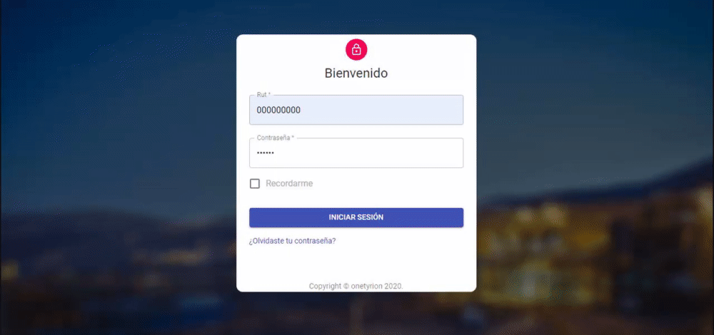

# [Material Dashboard React](https://demos.creative-tim.com/material-dashboard-react/#/dashboard) [](https://twitter.com/intent/tweet?url=https%3A%2F%2Fcreativetimofficial.github.io%2Fmaterial-dashboard-react&text=Material%20Dashboard%20React%20-%20Free%20Bootstrap%20Admin%20Template&original_referer=https%3A%2F%2Fdemos.creative-tim.com%2Fmaterial-dashboard-react%2F%3F_ga%3D2.10428917.198078103.1532329372-1803433978.1528781151&via=creativetim&hashtags=react%2Cmaterial-ui)


  



El proyecto actual consiste en implementar una plataforma web, que permita gestionar los datos usados en el área de planificación en relación a las detenciones de chancador primario y calcular sus KPIs para poder realizar un seguimiento de ellos. Junto a esto añadir un Datamart (Sinergia e Inteligencia de Negocio S.L, 2020) para propósito de análisis de los datos históricos del chancador primario, el cual servirá para alojar y mostrar desde una perspectiva amplia la información y verificar tanto la disponibilidad, como las detenciones (ej.: averías) del chancador. Con los datos reales de las detenciones del chancador primario suministrados en planillas Excel, se pretende alimentar la base de datos transaccional y luego cargarlos en el Datamart para la obtención de los KPI usados por los planificadores de modo mensual, como también la disponibilidad de forma anual. 

Los KPI de disponibilidad usados por los planificadores son cuatro: disponibilidad, MTTR (tiempo medio entre reparaciones), MTBF (tiempo medio entre fallas) y el MTBME (tiempo medio entre detenciones). Y para obtenerlos se usarán las mismas fórmulas que usan y se rigen (formulas en el punto 5). 

En cuanto a la plataforma tecnológica a usar para su despliegue, se considera usar un servicio en la nube. De tal manera, el sistema en general se hace más adaptable a los cambios, con una buena seguridad que se puede configurar y una disponibilidad que se encuentra garantizada, para los usuarios/miembros de planificación, dado que serían los únicos que usarían la solución en la empresa. 

Este proyecto fue desarrollado bajo las siguientes tecnologías:
- React: [ Biblioteca Javascript de código abierto diseñada para crear interfaces de usuario.](https://reactjs.org)
- NodeJS: [Entorno de ejecución para JavaScript construido con el motor de JavaScript V8 de Chrome.](https://nodejs.org/)
- Material-UI [Componentes de React para un desarrollo web sencillo y rápido.](https://material-ui.com)
- Express [Framework para Node. js que sirve para ayudarnos a crear aplicaciones web en menos tiempo.](https://expressjs.com/)
- Sequelize [Framework ORM de Node.js para soluciones como MySQL o Postgre y NOSQL.](https://sequelize.org)

## Quick start

Quick start :

- Clone the repo: `git clone https://github.com/onetyrion/Chancador_Primario`.
- [Descargar desde Github](https://github.com/onetyrion/Chancador_Primario).

## Estructura de Archivos

Atención! requiere actualizar

```
material-dashboard-react
.
├── CHANGELOG.md
├── ISSUE_TEMPLATE.md
├── LICENSE.md
├── README.md
├── bower.json
├── gulpfile.js
├── jsconfig.json
├── package.json
├── documentation
│   ├── assets
│   │   ├── css
│   │   ├── img
│   │   │   └── faces
│   │   └── js
│   └── tutorial-components.html
├── public
│   ├── favicon.ico
│   ├── index.html
│   └── manifest.json
└── src
    ├── index.js
    ├── logo.svg
    ├── routes.js
    ├── assets
    │   ├── css
    │   │   └── material-dashboard-react.css
    │   ├── github
    │   │   ├── md-react.gif
    │   │   └── react.svg
    │   ├── img
    │   │   └── faces
    │   └── jss
    │       ├── material-dashboard-react
    │       │   ├── components
    │       │   ├── layouts
    │       │   └── views
    │       └── material-dashboard-react.js
    ├── components
    │   ├── Card
    │   │   ├── Card.js
    │   │   ├── CardAvatar.js
    │   │   ├── CardBody.js
    │   │   ├── CardFooter.js
    │   │   ├── CardHeader.js
    │   │   └── CardIcon.js
    │   ├── CustomButtons
    │   │   └── Button.js
    │   ├── CustomInput
    │   │   └── CustomInput.js
    │   ├── CustomTabs
    │   │   └── CustomTabs.js
    │   ├── FixedPlugin
    │   │   └── FixedPlugin.js
    │   ├── Footer
    │   │   └── Footer.js
    │   ├── Grid
    │   │   ├── GridContainer.js
    │   │   └── GridItem.js
    │   ├── Navbars
    │   │   ├── AdminNavbarLinks.js
    │   │   ├── Navbar.js
    │   │   └── RTLNavbarLinks.js
    │   ├── Sidebar
    │   │   └── Sidebar.js
    │   ├── Snackbar
    │   │   ├── Snackbar.js
    │   │   └── SnackbarContent.js
    │   ├── Table
    │   │   └── Table.js
    │   ├── Tasks
    │   │   └── Tasks.js
    │   └── Typography
    │       ├── Danger.js
    │       ├── Info.js
    │       ├── Muted.js
    │       ├── Primary.js
    │       ├── Quote.js
    │       ├── Success.js
    │       └── Warning.js
    ├── layouts
    │   ├── Admin.js
    │   └── RTL.js
    ├── variables
    │   ├── charts.js
    │   └── general.js
    └── views
        ├── Dashboard
        │   └── Dashboard.js
        ├── Icons
        │   └── Icons.js
        ├── Maps
        │   └── Maps.js
        ├── Notifications
        │   └── Notifications.js
        ├── RTLPage
        │   └── RTLPage.js
        ├── TableList
        │   └── TableList.js
        ├── Typography
        │   └── Typography.js
        ├── UpgradeToPro
        │   └── UpgradeToPro.js
        └── UserProfile
            └── UserProfile.js
```

